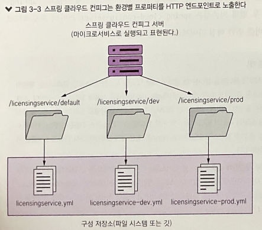
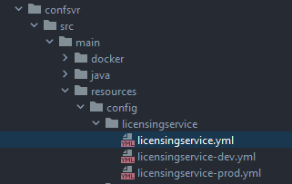
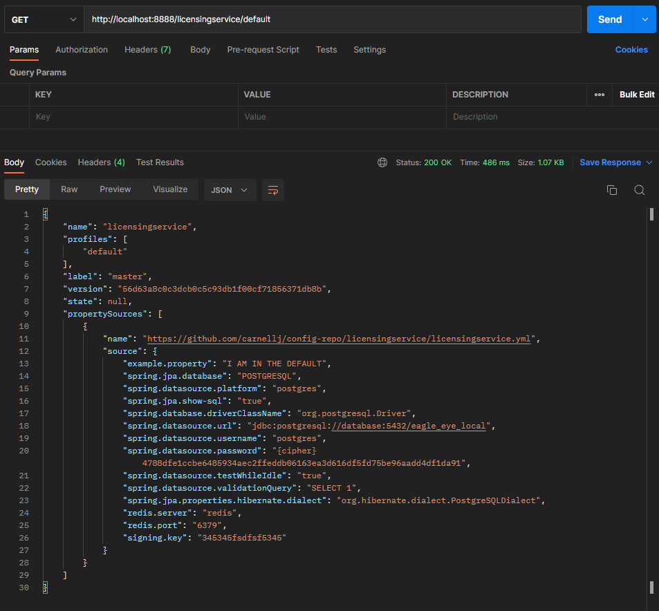
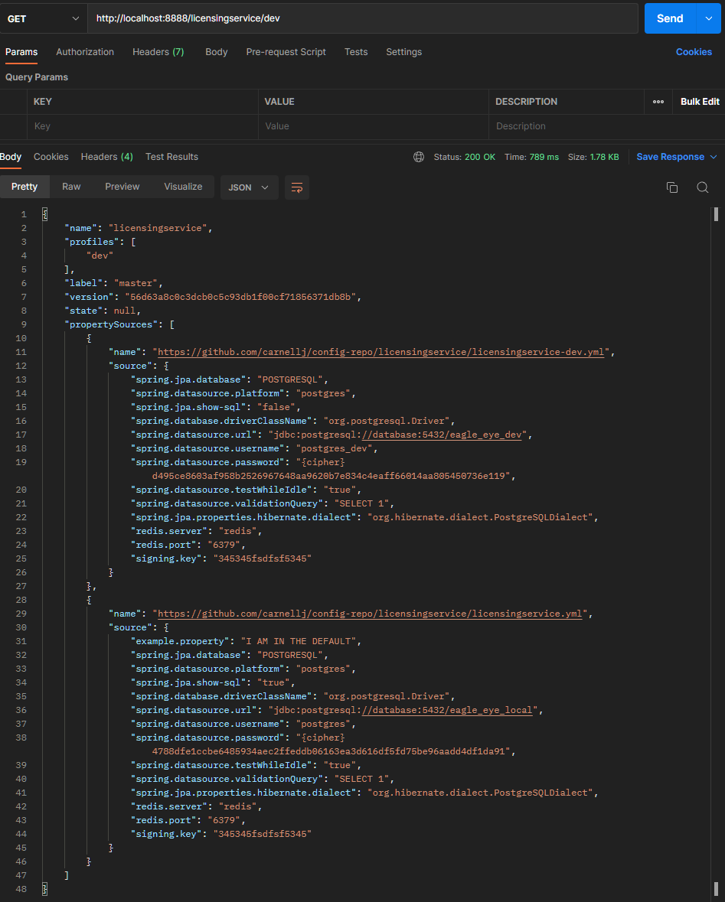
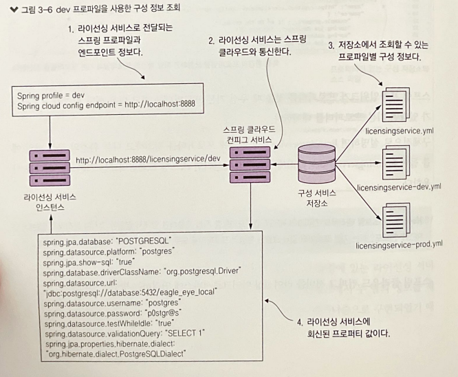

# ⭐ Spring Cloud Config Server (https://spring.io/projects/spring-cloud-config/)
스프링 클라우드 컨피그 서버란 다양한 벡엔드와 함께 일반적인 구성 관리 솔루션을 제공하는 오픈 소스 프로젝트이며, Git, Eureka, Consul 같은 백엔드와 통합 가능하다.

<br/> 

# ⭐ spring-cloud-starter-config 라이브러리 추가

### ✏ 라이브러리
```xml
<?xml version="1.0" encoding="UTF-8"?>
<project xmlns="http://maven.apache.org/POM/4.0.0" xmlns:xsi="http://www.w3.org/2001/XMLSchema-instance" xsi:schemaLocation="http://maven.apache.org/POM/4.0.0 https://maven.apache.org/xsd/maven-4.0.0.xsd">
    <modelVersion>4.0.0</modelVersion>

    <groupId>com.thoughtmechanix</groupId>
    <artifactId>licensing-service</artifactId>
    <version>0.0.1-SNAPSHOT</version>
    <packaging>jar</packaging>

    <name>Eagle Eye Licensing Service</name>
    <description>Licensing Service</description>

    <parent>
        <groupId>org.springframework.boot</groupId>
        <artifactId>spring-boot-starter-parent</artifactId>
        <version>2.7.4</version>
    </parent>

    <dependencyManagement>
        <dependencies>
            <dependency>
                <groupId>org.springframework.cloud</groupId>
                <artifactId>spring-cloud-dependencies</artifactId>
                <version>Finchley.RELEASE</version>
                <type>pom</type>
                <scope>import</scope>
            </dependency>
        </dependencies>
    </dependencyManagement>

    <dependencies>
        <dependency>
            <groupId>org.springframework.boot</groupId>
            <artifactId>spring-boot-starter-data-jpa</artifactId>
        </dependency>
        <dependency>
            <groupId>org.springframework.boot</groupId>
            <artifactId>spring-boot-starter-web</artifactId>
        </dependency>
        <dependency>
            <groupId>org.springframework.boot</groupId>
            <artifactId>spring-boot-starter-actuator</artifactId>
        </dependency>
        <dependency>
            <groupId>org.springframework.cloud</groupId>
            <artifactId>spring-cloud-starter-config</artifactId>
        </dependency>

        <dependency>
            <groupId>org.springframework.cloud</groupId>
            <artifactId>spring-cloud-config-client</artifactId>
        </dependency>
        <dependency>
            <groupId>com.h2database</groupId>
            <artifactId>h2</artifactId>
        </dependency>

        <dependency>
            <groupId>org.postgresql</groupId>
            <artifactId>postgresql</artifactId>
            <version>42.2.4</version>
            <!-- <version>9.4-1206-jdbc42</version> -->
            <!-- <version>9.4-1206-jdbc42</version> -->
        </dependency>
        <dependency>
            <groupId>org.springframework.security</groupId>
            <artifactId>spring-security-rsa</artifactId>
        </dependency>
    </dependencies>

    <properties>
        <project.build.sourceEncoding>UTF-8</project.build.sourceEncoding>
        <java.version>1.8</java.version>
        <project.build.sourceEncoding>UTF-8</project.build.sourceEncoding>
        <start-class>com.thoughtmechanix.licenses.Application</start-class>
        <docker.image.name>johncarnell/tmx-licensing-service</docker.image.name>
        <docker.image.tag>chapter3</docker.image.tag>
    </properties>

    <build>
        <plugins>
            <!-- We use the Resources plugin to filer Dockerfile and run.sh, it inserts actual JAR filename -->
            <!-- The final Dockerfile will be created in target/dockerfile/Dockerfile -->
            <plugin>
                <artifactId>maven-resources-plugin</artifactId>
                <executions>
                    <execution>
                        <id>copy-resources</id>
                        <!-- here the phase you need -->
                        <phase>validate</phase>
                        <goals>
                            <goal>copy-resources</goal>
                        </goals>
                        <configuration>
                            <outputDirectory>${basedir}/target/dockerfile</outputDirectory>
                            <resources>
                                <resource>
                                    <directory>src/main/docker</directory>
                                    <filtering>true</filtering>
                                </resource>
                            </resources>
                        </configuration>
                    </execution>
                </executions>
            </plugin>
            <plugin>
                <groupId>com.spotify</groupId>
                <artifactId>docker-maven-plugin</artifactId>
                <version>1.1.1</version>
                <configuration>
                    <imageName>${docker.image.name}:${docker.image.tag}</imageName>
                    <dockerDirectory>${basedir}/target/dockerfile</dockerDirectory>
                    <resources>
                        <resource>
                            <targetPath>/</targetPath>
                            <directory>${project.build.directory}</directory>
                            <include>${project.build.finalName}.jar</include>
                        </resource>
                    </resources>
                </configuration>
            </plugin>
            <plugin>
                <groupId>org.springframework.boot</groupId>
                <artifactId>spring-boot-maven-plugin</artifactId>
            </plugin>
        </plugins>
    </build>
</project>
```

<br/>

| 키워드                                                          | 설명                        |
|:-------------------------------------------------------------|:--------------------------|
| <version>2.7.4</version>                                     | 사용할 스프링 부트 버전             |
| spring-cloud-dependencies                                    | 사용할 스프링 클라우드 버전           |
| spring-cloud-config-server <br/> spring-cloud-starter-config | 이 서비스에 사용할 스프링 클라우드 프로젝트들 |
| com.thoughtmechanix.licenses.Application                                                             | 컨피그 서버용 부트스트랩 클래스         |

<br/>

컨피그 서버를 동작하게 하려면 여러 파일을 설정해야 함.
예를 들어 application.yml 파일에는 Spring Cloud Config Service가 수신 대기할 포트, 구성 데이터를 제공하는 벡엔드 위치 등의 정보를 명시

#### ✏️ confsvr/../resources/application.yml
```yaml
server:
  port: 8888
spring:
  cloud:
    config:
      server:
        # encrypt.enabled should moved to bootstrap.yml
        # encrypt.enabled: false
        git:
          uri: https://github.com/klimtever/config-repo/
          searchPaths: licensingservice,organizationservice
          username: native-cloud-apps
          password: 0ffended
```

<br/>
<br/>
<br/>

# ⭐ 구성 데이터를 보관할 백엔드 저장소 지정
빌드한 라이선싱 서비스를 Spring Cloud Config를 사용하는데 활용할 것인데, 간결하게 만들기 위해 로컬, 개발, 운영 환경을 위한 구성 데이터를 설정해보자

<br/>

### ✔ 각 환경에 두 가지 구성 프로퍼티 설정
> - 라이선싱 서비스가 직접 사용할 예제 프로퍼티
> - 라이선싱 서비스의 데이터가 저장될 Postgres 데이터베이스를 위한 데이터베이스 구성

Config Service를 구축하면 그 환경에 실행되는 마이크로서비스가 추가되며, 
구축되고 나서 서비스 콘텐츠는 HTTP/REST 엔드포인트로 액세스할 수 있음.



<br/>

애플리케이션 구성 파일의 명명 규칙은 appname-env.yml이다. 환경 이름은 URL에 그대로 반환되어 구성 정보를 조회하는 데 사용됨.



#### ✏ licensingservice.yml
```yaml
example.property: "I AM IN THE DEFAULT"
spring.jpa.database: "POSTGRESQL"
spring.datasource.platform:  "postgres"
spring.jpa.show-sql: "true"
spring.database.driverClassName: "org.postgresql.Driver"
spring.datasource.url: "jdbc:postgresql://database:5432/eagle_eye_local"
spring.datasource.username: "postgres"
spring.datasource.password: "{cipher}4788dfe1ccbe6485934aec2ffeddb06163ea3d616df5fd75be96aadd4df1da91"
spring.datasource.testWhileIdle: "true"
spring.datasource.validationQuery: "SELECT 1"
spring.jpa.properties.hibernate.dialect: "org.hibernate.dialect.PostgreSQLDialect"
redis.server: "redis"
redis.port: "6379"
signing.key: "345345fsdfsf5345"
```

<br/>
<br/>
<br/>


# ⭐ Spring Cloud Config BootStrap Class 생성

> #### ❓ BootStrap
> 일반적으로 BootStrap이란 어떠한 과정이 시작되어 알아서 진행되는 일련의 과정을 말함 

<br/>

#### ✏ confsvr/src/main/java/com/thoughtmechanix/confsvr/ConfigServerApplication.java
```java
import org.springframework.boot.SpringApplication;
import org.springframework.boot.autoconfigure.SpringBootApplication;
import org.springframework.cloud.config.server.EnableConfigServer;

@SpringBootApplication
@EnableConfigServer
public class ConfigServerApplication {
	public static void main(String[] args) {
		SpringApplication.run(ConfigServerApplication.class, args);
	}
}
```

|키워드| 설명                                                                       |
|:---|:-------------------------------------------------------------------------|
|@SpringBootApplication| Spring Cloud Config Service는 스프링 부트 애플리케이션이므로 @SpringBootApplication을 사용 |
|@EnableConfigServer| @EnableConfigServer는 서비스를 Spring Cloud Config 서비스로 사용 가능하게 한다.           |
|main(String[] args)| main() 메서드에서 서비스와 스프링 컨테이너를 시작한다.                                        |

<br/>
<br/>
<br/>

# ⭐ 파일 시스템과 Spring Cloud Config Server 사용
confsvr/src/main/resources/application.yml 파일에다 애플리케이션 구성 데이터를 보관할 저장소를 지정함

#### ✏ confsvr/src/main/resources/application.yml
```yaml
_server:
   port: 8888
spring:
  profiles:
    active: native
  cloud:
     config:
       server:
           native:
              searchLocations: file://<chapter 3>/confsvr/src/main/resources/config/licensingservice,
                               file://<chapter 3>confsvr/src/main/resources/config/organizationservice_
```

|키워드| 설명                          |
|:---|:----------------------------|
|port: 8888| 스프링 클라우드 컨피그 서버가 수신 대기하는 포트 |
|active: native| 구성 정보를 저장할 백엔드 저장소 (파일 시스템) |
|searchLocations: https://github.com/ImKunYoung/mssb_spring-cloud-config.git| 구성 파일이 저장된 경로               |


<br/>

#### ✏ 구성 요청을 수신 대기할 포트 번호 지정
```yaml
server:
   port: 8888
```

<br/>

#### ✏ 애플리케이션의 구성 정보가 파일 시스템에 담겨있기 때문에 스프링 클라우드 컨피그 서버에 native 프로파일을 실행하도록 지시
```yaml
spring:
  profiles:
    active: native
```

<br/>

#### ✏ Spring Cloud Config에 애플리케이션 데이터가 있는 디렉터리 지정
```yaml
spring:
  cloud:
     config:
       server:
         native:
           searchLocations: file://<chapter 3>/confsvr/src/main/resources/config/licensingservice,
                            file://<chapter 3>confsvr/src/main/resources/config/organizationservice_
```

> 컨피그 서버가 관리하는 프로퍼티를 가진 각 애플리케이션의 디렉터리를 쉼표(,) 로 구분해 넣음

<br/>

#### ✏ 실행

```mvn spring-boot:run```

<br/>

#### ✏ 테스트






> dev 엔드포인트를 호출하면 default와 dev, 두 환경에 있는 라이선싱 서비스의 구성 프로퍼티를 반환하는 것을 알 수 있다.
> 스프링 프레임워크가 프로퍼티를 분석하는 데 계층적 매커니즘으로 구현되었기 때문이다.

> 스프링 프레임워크가 프로퍼티를 찾을 때 default 프로퍼티를 찾고 다음 환경의 프로퍼티가 있다면 다음 프로퍼티로 대체한다.

<br/>
<br/>
<br/>


# ⭐ Spring Cloud Config와 Spring-Boot Client 통합
스프링 데이터 (Spring Data)를 사용해 데이터베이스와 통신하고 라이선싱 테이블의 데이터를 POJO와 매핑한다




<br/>
<br/>

### ✔ 스프링 클라우드 컨피그 서버의 의존성 설정

<br/>

#### ✏ 라이선싱 서비스에 의존성 추가
```xml
<dependencies>
    <dependency>
        <groupId>org.springframework.boot</groupId>
        <artifactId>spring-boot-starter-data-jpa</artifactId>
    </dependency>
    <dependency>
        <groupId>org.springframework.cloud</groupId>
        <artifactId>spring-cloud-config-client</artifactId>
    </dependency>
    <dependency>
        <groupId>org.postgresql</groupId>
        <artifactId>postgresql</artifactId>
        <version>42.2.4</version>
    </dependency>
</dependencies>
```
| 키워드                                                   | 설명                                                |
|:------------------------------------------------------|:--------------------------------------------------|
| `<artifactId>spring-boot-starter-data-jpa</artifactId>` | 스프링 부트에 Java Persistance API (JPA) 사용을 지시한다       |
| `<artifactId>postgresql</artifactId>`                   | 스프링 부트에 Postgres JDBC 드라이버를 내려받오록 지시한다            |
| `<artifactId>spring-cloud-config-client</artifactId>`                  | 스프링 부트에 스프링 클라우드 컨피그 클라이언트가 되는데 필요한 의존성을 내려받도록 지시 |


